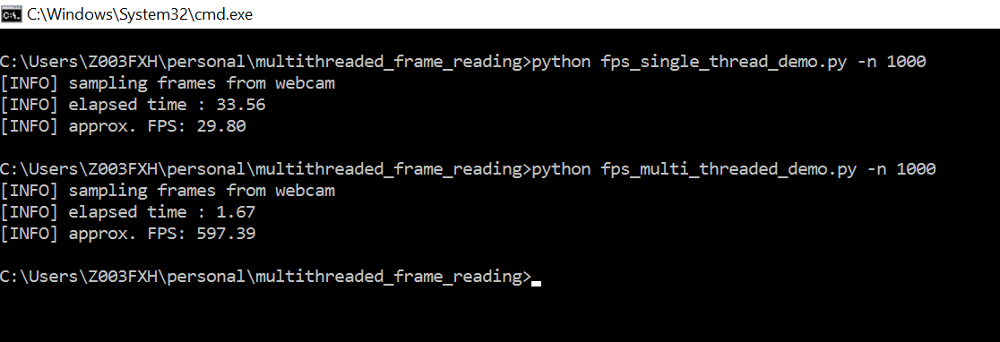

# multithreaded_frame_reading
Script to read frames from the camera using multithreading Python. 

Thanks to [Adrian Rosebrock](https://www.pyimagesearch.com/2015/12/21/increasing-webcam-fps-with-python-and-opencv/) 
article on how to increase webcam FPS with Pythonn and OpenCV. Provides a good insight to the subject.

## Objective
Reading frames from a camera is a common operation in Computer Vision. OpenCV provides many APIs to accomplish it.
General flow of any application involves reading a frame and then processing it.
However the task of reading the frame is heavily I/O bounded, meaning the CPU is sitting idle for the most time while the frame is being read.
Since the flow of the application is sequential, it leads to CPU being underutilized, leding to low FPS (frames per second) value,
which can degrade the performance of the application.


The objective is to imporve our **FPS** simply by reading the frames in a separate thread while our main thread handles the processing of 
our current frame.

## Description
Accessing your webcam/USB camera using the `cv2.VideoCapture`  function and the `.read()`  method is a blocking operation. 
The main thread of our Python script is completely blocked (i.e., “stalled”) until the frame is 
read from the camera device and returned to our script.

I/O tasks, as opposed to CPU bound operations, tend to be quite slow. While computer vision and video 
processing applications are certainly quite CPU heavy (especially if they are intended to run in real-time), 
it turns out that camera I/O can be a huge bottleneck as well.

`imutil.py` defines two classes:
`FPS` class that is used to measure frames per second
```
# import the necessary packages
import datetime
 
class FPS:
	def __init__(self):
		# store the start time, end time, and total number of frames
		# that were examined between the start and end intervals
		self._start = None
		self._end = None
		self._numFrames = 0
 
	def start(self):
		# start the timer
		self._start = datetime.datetime.now()
		return self
 
	def stop(self):
		# stop the timer
		self._end = datetime.datetime.now()
 
	def update(self):
		# increment the total number of frames examined during the
		# start and end intervals
		self._numFrames += 1
 
	def elapsed(self):
		# return the total number of seconds between the start and
		# end interval
		return (self._end - self._start).total_seconds()
 
	def fps(self):
		# compute the (approximate) frames per second
		return self._numFrames / self.elapsed()
```
Implementation is pretty straight forward. 
- `_start` is the starting timestamp of frame read
- `_end` is the ending timestamp, when frame read is stopped.
- `_numFrames` stores the number of frames read, during the interval
- `start` and `stop` method kicks-off & stops the timer respectively.
- `update` method increments number of frames that have been read.
- `elapsed` method returns the seconds elapsed between the start and the end of frame reading.
- `fps` method return the fps of the camera by taking total number of frames read and dividing
it by number of elapsed seconds.


`WebCamVideoStream` class that will access our webcam in a threaded fashion
```
# import the necessary packages
from threading import Thread
import cv2
 
class WebcamVideoStream:
	def __init__(self, src=0):
		# initialize the video camera stream and read the first frame
		# from the stream
		self.stream = cv2.VideoCapture(src)
		(self.grabbed, self.frame) = self.stream.read()
 
		# initialize the variable used to indicate if the thread should
		# be stopped
		self.stopped = False
```
Constructor gets the pointer to the stream using the `cv2.VideoCapture` method.
`src=0` is presumed to be the index of the webcam.
```
def start(self):
	# start the thread to read frames from the video stream
	Thread(target=self.update, args=()).start()
	return self
 
def update(self):
	# keep looping infinitely until the thread is stopped
	while True:
		# if the thread indicator variable is set, stop the thread
		if self.stopped:
			return

		# otherwise, read the next frame from the stream
		(self.grabbed, self.frame) = self.stream.read()

def read(self):
	# return the frame most recently read
	return self.frame
 
def stop(self):
	# indicate that the thread should be stopped
	self.stopped = True
```
`start` method creates & starts the actual thread for frame reading. It does this by creating a `Thread` object
and using the `update` method as the callable object invoked by the `run` method of the thread.
Once the `start` method of `WebCamVideoStream` will be called, it will invoke the internal `run` method of thread,
which will inturn invoke the `update` method of the class.

## Results

As seen from above results, there is a drastic imporve in the FPS value, when using a multithreaded frame reading approach.
Only caveat here is, the increase is due to the increase in frame reading time and reduction in latency time, i.e. waiting 
time for frame, since frame will always be present.


## Conclusions
We learned how threading can be used to increase your webcam FPS using Python and OpenCV.


we were able to obtain a drastic increase in FPS simply by using threading. However the number not only reflects the
increase in the FPS but also accomodates for the decrease in latency since the frame is always ready to be processed, 
hence reducing the latency time.


**In nearly all situations, using threaded access to your webcam can substantially improve your video processing pipeline.**
## References
- https://www.pyimagesearch.com/2015/12/21/increasing-webcam-fps-with-python-and-opencv/
- https://nrsyed.com/2018/07/05/multithreading-with-opencv-python-to-improve-video-processing-performance/
